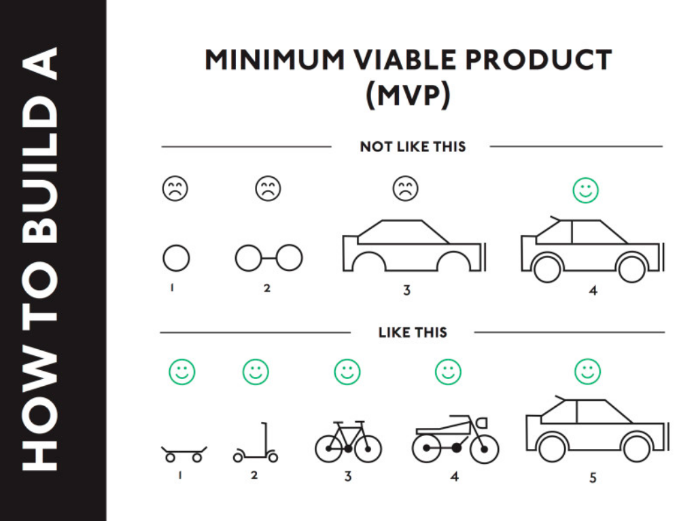

# Entry 1: What is Java?

## Java
Java is a general-purpose computer-programming language that is concurrent, class-based, object-oriented, and specifically designed to have as few problems as possible. Overall Java is used to make programs and create video games.

## Codecademy
I been looking through Codecademy for this week and found that Java *is* very similar to html, css and ruby. Codecademy is a very dependable platform that offers free coding classes in many different programming languages including Python, Java, JavaScript, Ruby, SQL and many more. I been doing the basics in Java such as booleans, integers, charaters, variables, and simple math. 

## Takeaways

### 2. There are going to be moments where we have no clue were to go or stop. Just look at were we are and realize what is there.

Start with your skateboard and make modifications.

### QotW

*“We are, at least in part, who we remember ourselves to be. Take away our memories, and you take away our selves.” 
  
― Beth Revis, The Body Electric*