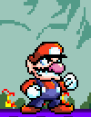
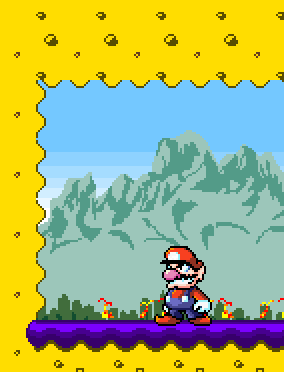
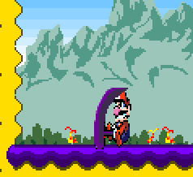
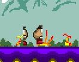

# Sprites are a son of a b... #

Doing this project was not going to be easy. But I thought it was going to. Making this was walking into the depths of hell and returning with a butter smooth sprite. It's a real boy! We ***had*** our character set in mind. but didn't have the three brains we need and capability to make this. Literally took me and my partner, Simeon, 48 hours to **make** our sprite, Lario, a nimble young lad here.

# ...ug technically. #

Having this out of the way, we started making the the level around our nimble young lad. *As you can see from the bottom of our screenshot.*

Not 100% sure if you have noticed but we also found a way to make out sprite become flipped without distortion. Making that was an absolute killer. Trying to find the specific heights and widths of our character. We have come the the problem of the occasional "distortion" of our character with he is using this pound attack to the left of the screen. (Look at the picture below) I know earlier I said we had not problem of distortion with our character when he is flipped to the other side. Finding the problem to this error is fueling us to continue working on this besides the fact that it is still in beta. We are trying our best to implement a boss at the end of this level as well as making a transition to out second level we are making as of yesterday. 

We also have another problem that is not game breaking. We have our little enemy, a groomba, *(Yes, that's what it's called...)* to have the occasional glitching with is sprites are not completely aligned but due to this fact that we are aware of, we are going to fix it at a later state and not instantly, due to it not being a game breaking bug, and it just some guess and check with the .png file and the code and the output. (Below it the bug of the groomba)

# Takeaways #

1. MVP.
2. Make sure the animations are not a mess of .png's or a .gif's.
3. Making it easier doesn't make making less fun.
4. Make what you wanna make as long as it makes you happy.
