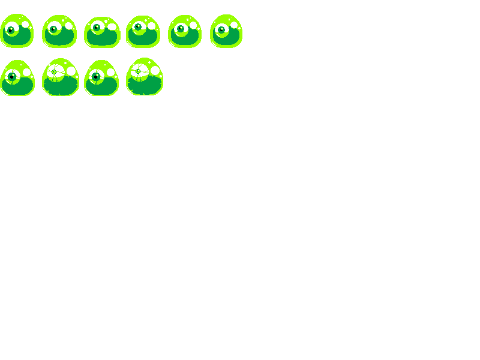
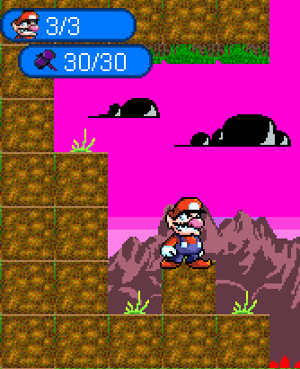

# DLC: Incoming...not really

## More like updates
We had just finished our MVP last week and now we are aiming for extra stuff for our java game to be given more pop.

### 1. Boss(Aka Slime King)!

Trying to implement a boss was a pain. Making it appear when the player got to a certain distance in the level, making the tilemap change also based on if those conditions were met. and making the boss look like the sprite we had for them. Also not making him clip with his animation.

### 2. To the next level!

Trying to implement a door to make it change to the second level is a pain. (Yes, we are still working on and it doesn't mean we will not be working on our presentation.) Trying to make the code so that the player has to be "on top of" the door and when pressed down, he goes through it and goes to the next level. Speaking of level 2...

### 3. Level 2!

We have almost everything down pat for this. We still need a bit of debugging but nothing like a school night to crank this out. Just need to fix the enemy positions, the tilemap, the background...

Partners HELP!!!

Just kidding. They have been such a huge help in the project. Honestly, I wouldn't be a finalist with them without them.

And remember, it only a tease of level 2.

# Takeaways

1. Don't forget everything has a time limit.
2. Done is better than perfect.
3. Sometimes quality is better than quantity.